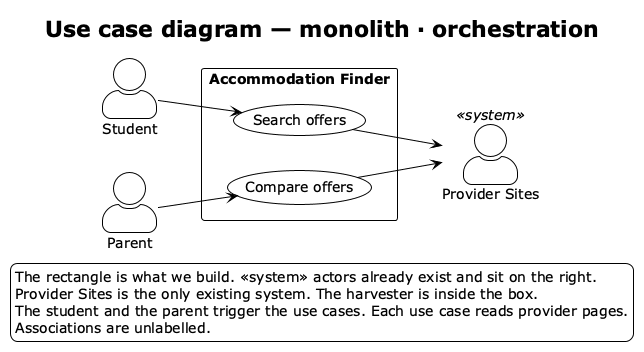
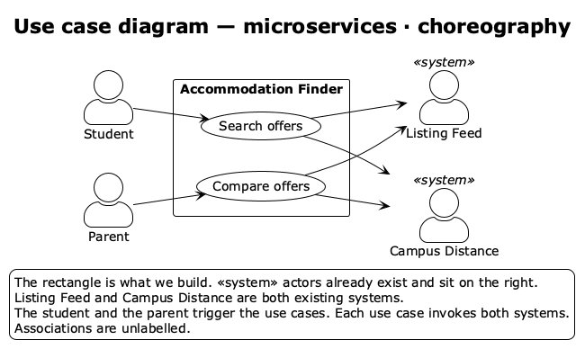
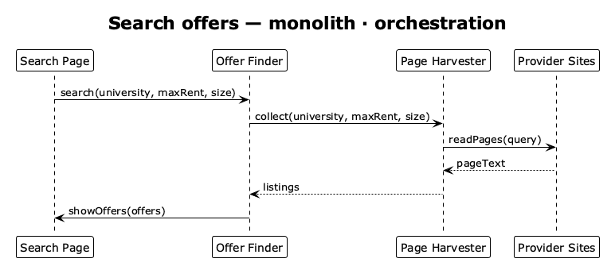
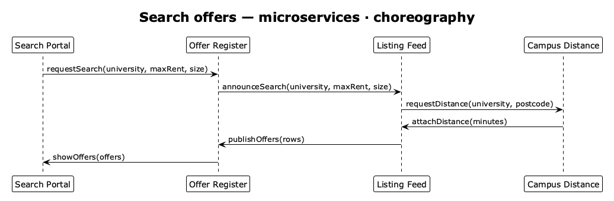
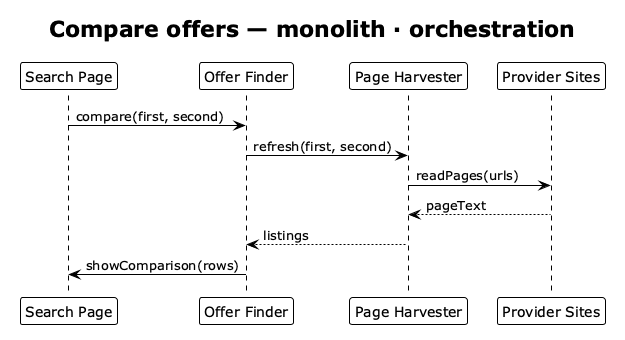
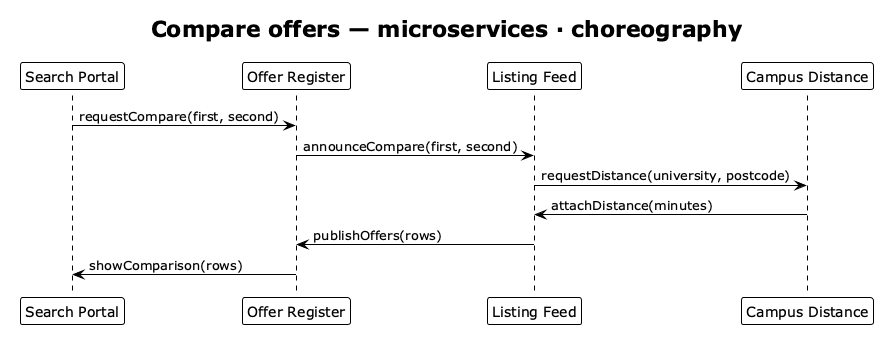
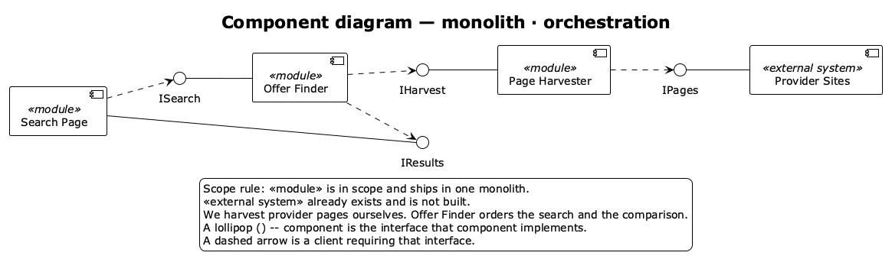
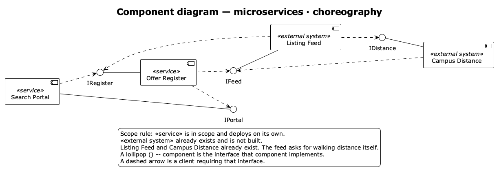

# Accommodation Finder

An app that gathers student accommodation from provider pages and lets people search and compare it. Two stories fill the gaps in the brief: what “price”, “size”, and “distance” mean, and what a comparison is.

## User stories

**Maya, a student.** She is choosing a place for next year and is looking at more than one provider. She wants offers within walking distance of her campus, under a weekly rent she can pay, and a single room rather than a shared flat.

**David, a parent.** He and his daughter already have two offers, from different providers. He wants the weekly rent, the room size, and the distance from the university side by side, taken from those providers’ own pages.

Price means weekly rent. Size means a single room, a shared room, or a whole flat. Distance means walking minutes from the campus the student names. Search returns a list. Compare returns those three facts for two chosen offers.

---

## Use case diagram

The student starts a search. The parent starts a comparison. In the monolith we harvest the pages ourselves, so only provider sites sit outside the box. In the microservices variant the listing feed and campus distance already exist, so both sit outside the box.

### Monolith · orchestration

### Microservices · choreography

---

## Architecture and interaction-style decision

Candidates: a layered monolith, microservices, an MVP-style page that only displays what the finder returns, and event-driven publish/subscribe. Interaction is either orchestration (one component orders the steps) or choreography (each party reacts).

**Monolith · orchestration.** We do not already have a feed of offers, so the harvester is ours and ships with the page and the finder. The finder orders the work: collect listings, add walking distance, then show the list or the comparison.

**Microservices · choreography.** A listing feed and a campus distance service already exist. We deploy only the portal and the register. The feed asks for walking distance itself. The register records the rows and tells the portal. It does not scrape pages and it does not calculate distance.

---

## Sequence diagrams

Main success only. The monolith variant is above the microservices variant. A solid arrow is a call. A dashed arrow is the value that call returns.

### Search offers

The finder does not show offers until the harvester has read the provider pages. It adds walking distance to the campus, then shows the list.

The portal only asks the register. The feed obtains walking distance and publishes the rows. The register then shows them.

### Compare offers

The same order for two chosen offers: refresh the pages, then show weekly rent, size, and distance together.

The register asks the feed to refresh the two offers. Distance still comes back from the campus service, not from the register.

---

## Component diagram

Four components in each variant. A named lollipop is the interface that component implements. A dashed arrow means a client requires it.

### Monolith · orchestration

Search Page, Offer Finder, and Page Harvester are modules in one deployable. Provider Sites already exist. The page never reads a provider site itself. The finder never reads one either. Only the harvester does.

### Microservices · choreography

Search Portal and Offer Register are the services we deploy. Listing Feed and Campus Distance already exist. The portal talks only to the register. The feed is the component that calls campus distance.

---

## Scope and architecture choices

| Component | monolith · orchestration | microservices · choreography | Responsibility |
|-----------|--------------------------|------------------------------|----------------|
| Search Page | `<<module>>` | — | Page where the student searches and the parent compares |
| Search Portal | — | `<<service>>` | Same job, deployed on its own |
| Offer Finder | `<<module>>`, orchestrator | — | Orders collection, adds walking distance, returns the list or the comparison |
| Offer Register | — | `<<service>>` | Records a search or a comparison and passes on the rows it is given |
| Page Harvester | `<<module>>` | — | Reads provider pages and returns listings |
| Listing Feed | — | `<<external system>>` | Existing offers. Asks campus distance, then publishes rows |
| Provider Sites | `<<external system>>` | — | Public provider pages |
| Campus Distance | — | `<<external system>>` | Existing walking time from a campus to a postcode |

---

## Consequences for non-functional requirements

| Non-functional requirement | monolith · orchestration | microservices · choreography |
|----------------------------|--------------------------|------------------------------|
| Security | One deployable holds the page, the finder, and the harvester. The trust boundary is the read of public provider pages. | The portal, the register, the feed, and campus distance are separate parties. Each call needs a known sender. Listings cross in from a feed we do not run. |
| Cost of deployment and communication | One unit to release. Reading provider pages is the network hop. | Two services to release, plus a call to the feed and a call to campus distance on every search and comparison. |
| Reliability | Nothing is shown until the page read returns. If the finder stops, search and comparison stop with it. | The portal can be down while the feed still publishes. A lost publish leaves the register behind the feed, so the same offer can arrive twice. |
| Auditability / transparency | The finder sees the page text and the list it showed, so one log can say where an offer came from. | The register records the rows it was given. The page read and the distance calculation stay with the feed and the campus service. |
| Safety | The finder shows an offer only after a page has been read, and it attaches distance before `showOffers` or `showComparison`. | Walking time comes from Campus Distance. We show that figure. We do not replace it with one we calculated. |
