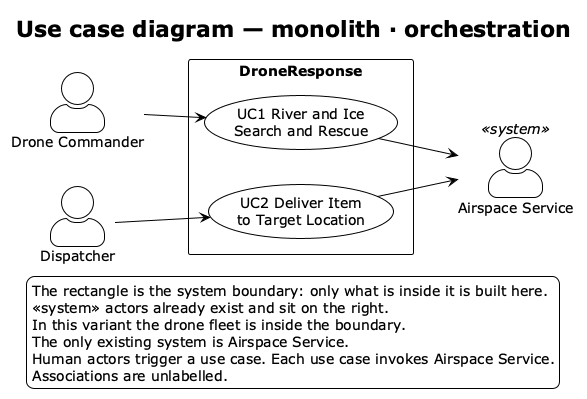
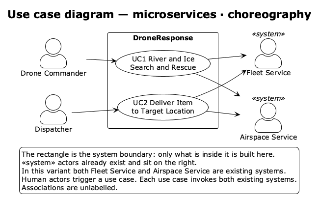
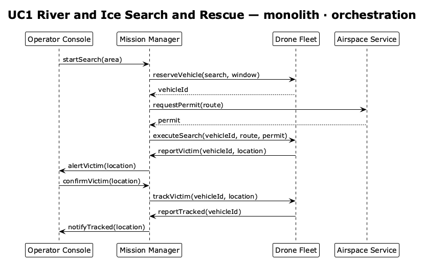
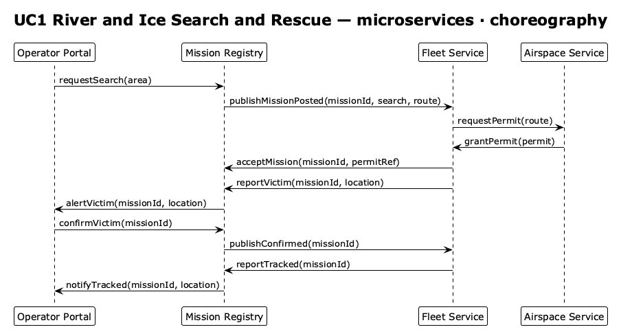
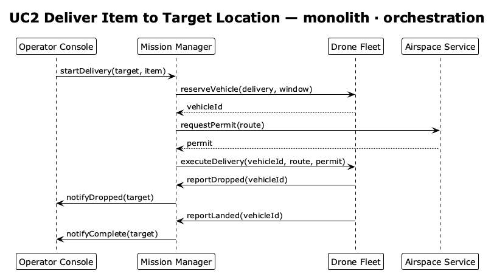
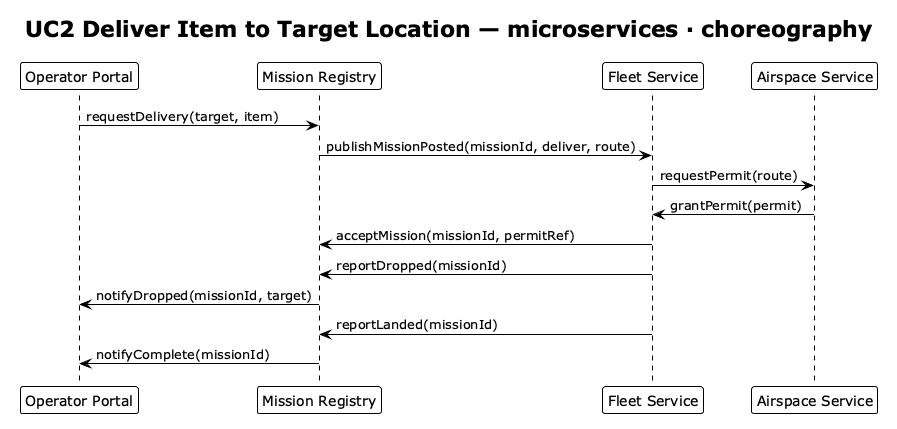
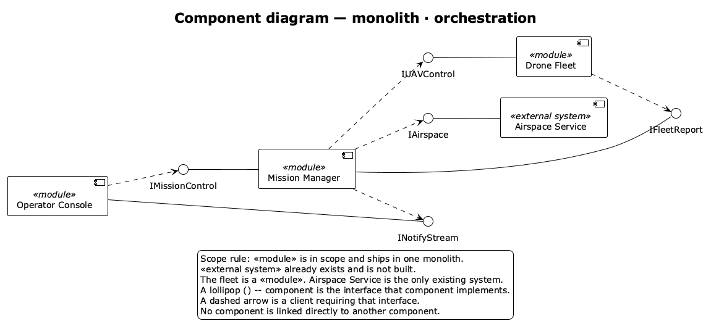
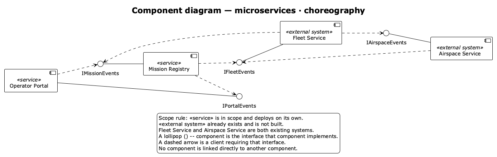

# DroneResponse — Simple Design

This document is the simple-study design for **DroneResponse**. It follows `docs/requirements-for-simple-diagrams.md` and the scope in `docs/system-requirements.md`.

Source use cases, from [sUAS-UseCases (SPLC-2020)](https://github.com/SAREC-Lab/sUAS-UseCases):

| UC | Name | Primary actor | Goal on the main success path |
|----|------|---------------|--------------------------------|
| UC1 | River and Ice Search and Rescue | Drone Commander | Search the river or ice, detect a victim, confirm the sighting, and track the victim |
| UC2 | Deliver Item to Target Location | Dispatcher | Carry an item to the target coordinates, release it, and land at home |

The study presents both variants so the boundary change is visible:

- **monolith · orchestration** — the drone fleet is inside the system. Only Airspace Service is an existing `<<system>>` actor.
- **microservices · choreography** — Fleet Service and Airspace Service are both existing `<<system>>` actors.

Interfaces with pre- and postconditions, the data model, interface state machines, and object-oriented design are outside this study. The document stops at the component diagram, then records scope and non-functional consequences.

## Assumptions

- The main success path is linear. Low-confidence sightings, a rejected confirmation, a reassigned aircraft, and a manual flotation delivery are omitted.
- UC1 ends when the victim is tracked and the commander has been told. The source scenario's later item delivery is UC2, with its own actor, and is not nested inside UC1.
- UC2's primary actor is the Dispatcher, as in the system requirements. The source text also names the Drone Commander; this study uses the Dispatcher so the two use cases have two different actors.
- People act only through the operator-facing component. Sequence lifelines are components, one per component in that variant, and there are four of them.
- Image capture and onboard analysis stay inside the fleet component. A separate analysis component would exceed the four-component limit. Mission state stays inside Mission Manager or Mission Registry for the same reason.
- A flight may start only after a permit exists. In the monolith, Mission Manager obtains the permit and passes it into the execute call. In the microservices variant, Fleet Service obtains the permit and later tells Mission Registry the permit reference, so the registry has an audit mark without holding the permit that authorizes flight.
- Choreography still has a direction on each message: publishing an event is a call on the interface the receiver implements. The structural difference is who is allowed to take the next step. Mission Registry announces that a mission was posted and that a sighting was confirmed. It does not reserve an aircraft, and it does not obtain a permit.

## 1. Use Case Diagram

Each variant has its own use case diagram. The rectangle is the part to be built. Human actors stand on the left and trigger the use case. Existing systems stand on the right, and the use case invokes them. Associations carry no label.

### 1.1 Use case diagram — monolith · orchestration

*Use case diagram — monolith · orchestration* `diagrams/cursor_uc_mono.puml`

Drone Commander triggers UC1. Dispatcher triggers UC2. Both use cases invoke Airspace Service, because a search and a delivery each need a flight permit. The fleet does not appear as an actor: it is inside DroneResponse, in the same build as the console and the mission logic.

### 1.2 Use case diagram — microservices · choreography

*Use case diagram — microservices · choreography* `diagrams/cursor_uc_micro.puml`

The same two people trigger the same two use cases. The boundary is smaller. Fleet Service and Airspace Service are both existing systems, so both stand on the right, and both use cases invoke both of them. What remains inside the rectangle is the operator portal and the mission record. The sequence diagrams show how that invocation is split: the portal and the registry deal with the fleet, and the fleet deals with airspace.

## 2. Architecture and Interaction-Style Decision

Candidate architectures:

- **Layered monolith.** One deployable unit. Modules call each other in process. A UI layer, a mission layer, and a fleet layer can still be separate code, shipped together.
- **Microservices.** Independently deployable services with a network boundary between them.
- **MVP-style UI.** A thin view forwards the operator's action and renders what the mission component returns. It fits either deployment topology; it does not decide who owns the fleet.
- **Event-driven publish/subscribe.** Participants announce facts. The next participant reacts. There is no single component that holds the permit and then orders the flight.

Candidate interaction styles:

- **Orchestration.** One component orders the steps: reserve an aircraft, obtain a permit, start the flight, accept the confirmation, then track or release.
- **Choreography.** Each participant reacts to the fact it is responsible for. The fleet asks for its own permit after it has seen a posted mission.

MVP-style UI is used in both variants for the operator-facing component: the console or portal sends the command or confirmation and displays alerts. It does not decide the flight. The study then commits to the two pairings the system requirements ask to compare.

**monolith · orchestration.** The fleet is ours, so it can be a module in the same deployable as the console and Mission Manager. Mission Manager is the orchestrator. It is the only in-scope component that calls Airspace Service, and it is the only component that passes a permit into an execute call. One process can keep the order reserve, then permit, then execute, without a network saga. This pairing fits a team that builds and operates the aircraft software itself and wants one place that authorizes the next step.

**microservices · choreography.** The fleet already exists as someone else's service, so it stays outside the build, next to the airspace authority. Operator Portal and Mission Registry are the two services we deploy. They publish and record mission facts. Fleet Service reacts by requesting a permit and flying. A central orchestrator inside our boundary would be pretending to control an aircraft stack we do not own. Choreography matches that boundary: our services state what is known (area, target, confirmation), and the existing fleet states what it did (accepted, dropped, landed, tracked).

Layered-monolith modules with choreography, or microservices with a single orchestrator that commands an external fleet, are not developed here. The boundary and the interaction style move together in this study: owning the fleet supports one orchestrator in one deployable; integrating an existing fleet supports choreography across the two services we do own.

## 3. Sequence Diagrams

Lifelines are the components of that variant. Each diagram is the main success path only. A solid arrow is an operation call. A dashed arrow is the return value of the call it answers. For each use case the monolith variant is above the microservices variant.

### 3.1 UC1 — River and Ice Search and Rescue

**monolith · orchestration**

*UC1 River and Ice Search and Rescue — monolith · orchestration* `diagrams/cursor_seq_uc1_mono.puml`

Mission Manager drives the path. `reserveVehicle` returns `vehicleId`. `requestPermit` returns `permit`. Only then does `executeSearch` run, and the permit travels with that call. The fleet's later messages (`reportVictim`, `reportTracked`) are new calls on the report interface Mission Manager implements; they are not return values of `executeSearch`. The console confirms the sighting before `trackVictim`.

**microservices · choreography**

*UC1 River and Ice Search and Rescue — microservices · choreography* `diagrams/cursor_seq_uc1_micro.puml`

Operator Portal records the search and, after the alert, records the commander's confirmation. Mission Registry tells the fleet that a mission was posted and that the sighting was confirmed. Fleet Service calls Airspace Service itself. `grantPermit` is a separate call, not a return value: the authority publishes the grant onto the fleet's event interface. The fleet then records `acceptMission` with a permit reference, reports the victim, and, after confirmation is published, reports that tracking has started. Registry notifies the portal. No in-scope component receives the permit or passes it into a flight call.

### 3.2 UC2 — Deliver Item to Target Location

**monolith · orchestration**

*UC2 Deliver Item to Target Location — monolith · orchestration* `diagrams/cursor_seq_uc2_mono.puml`

The same orchestrated order serves delivery: reserve, permit, then `executeDelivery` with the permit. The fleet reports the drop and the landing as separate calls. The console is told after each of those facts. There is no confirmation step, because the source main success path releases the item once the aircraft is at the target.

**microservices · choreography**

*UC2 Deliver Item to Target Location — microservices · choreography* `diagrams/cursor_seq_uc2_micro.puml`

The portal requests the delivery. The registry publishes the posted mission. The fleet obtains the permit, records acceptance, reports the drop, and reports the landing. The registry forwards those two facts to the portal. The permit again stays between Fleet Service and Airspace Service.

Message names are the operation names of the interfaces in the component diagrams. `vehicleId` and `permit` are the only return values, and each answers the call immediately above it.

## 4. Component Diagrams

Four components in each diagram. In-scope parts use `<<module>>` or `<<service>>`. Existing systems use `<<external system>>`. A named lollipop is attached to the component that implements it. A client requires it with a dashed arrow. Nothing connects two components directly.

### 4.1 Component diagram — monolith · orchestration

*Component diagram — monolith · orchestration* `diagrams/cursor_component_mono.puml`

| Interface | Implemented by | Required by | Operations used above |
|-----------|----------------|-------------|------------------------|
| IMissionControl | Mission Manager | Operator Console | `startSearch(area)`, `confirmVictim(location)`, `startDelivery(target, item)` |
| IFleetReport | Mission Manager | Drone Fleet | `reportVictim(vehicleId, location)`, `reportTracked(vehicleId)`, `reportDropped(vehicleId)`, `reportLanded(vehicleId)` |
| IUAVControl | Drone Fleet | Mission Manager | `reserveVehicle(role, window)`, `executeSearch(vehicleId, route, permit)`, `trackVictim(vehicleId, location)`, `executeDelivery(vehicleId, route, permit)` |
| IAirspace | Airspace Service | Mission Manager | `requestPermit(route)` |
| INotifyStream | Operator Console | Mission Manager | `alertVictim(location)`, `notifyTracked(location)`, `notifyDropped(target)`, `notifyComplete(target)` |

`IFleetReport` exists so a fleet report is a call on an interface Mission Manager implements. The console never calls the fleet, and the fleet never calls the console. Airspace Service is reached only from Mission Manager.

### 4.2 Component diagram — microservices · choreography

*Component diagram — microservices · choreography* `diagrams/cursor_component_micro.puml`

| Interface | Implemented by | Required by | Operations used above |
|-----------|----------------|-------------|------------------------|
| IPortalEvents | Operator Portal | Mission Registry | `alertVictim(missionId, location)`, `notifyTracked(missionId, location)`, `notifyDropped(missionId, target)`, `notifyComplete(missionId)` |
| IMissionEvents | Mission Registry | Operator Portal, Fleet Service | `requestSearch(area)`, `requestDelivery(target, item)`, `confirmVictim(missionId)`, `acceptMission(missionId, permitRef)`, `reportVictim(missionId, location)`, `reportTracked(missionId)`, `reportDropped(missionId)`, `reportLanded(missionId)` |
| IFleetEvents | Fleet Service | Mission Registry, Airspace Service | `publishMissionPosted(missionId, task, route)`, `publishConfirmed(missionId)`, `grantPermit(permit)` |
| IAirspaceEvents | Airspace Service | Fleet Service | `requestPermit(route)` |

Operator Portal requires only `IMissionEvents`. It never calls the fleet or the airspace authority. Fleet Service requires `IAirspaceEvents` and `IMissionEvents`. Airspace Service requires `IFleetEvents` so the grant is a call the fleet receives. That dependency is absent from the monolith, where the grant is the return value of `requestPermit` and only Mission Manager sees it.

## 5. Scope and Architecture Choices

| Component | monolith · orchestration | microservices · choreography | Responsibility |
|-----------|--------------------------|------------------------------|----------------|
| Operator Console / Operator Portal | `<<module>>`, in the monolith | `<<service>>`, in scope | Operator-facing UI. Drone Commander starts and confirms a search. Dispatcher starts a delivery. The component displays alerts and progress. |
| Mission Manager / Mission Registry | `<<module>>`, orchestrator | `<<service>>`, in scope | Mission lifecycle. The manager orders reserve, permit, and execute, and accepts fleet reports. The registry records requests, acceptance, and progress, and publishes the posted mission and the confirmation. |
| Drone Fleet / Fleet Service | `<<module>>`, in scope | `<<external system>>`, existing | Aircraft execution, including onboard image analysis. The module flies when the manager passes a permit. The existing service requests its own permit and reports facts. |
| Airspace Service | `<<external system>>`, existing | `<<external system>>`, existing | Grants the flight permit. Called by Mission Manager in the monolith, and by Fleet Service in the microservices variant. |

## 6. Consequences for Non-Functional Requirements

| Non-functional requirement | monolith · orchestration | microservices · choreography |
|----------------------------|--------------------------|------------------------------|
| Security | One deployable holds the console, the mission decisions, and the fleet commands. The trust boundary that leaves the process is the call to Airspace Service. Access control for start, confirm, and execute sits in Mission Manager. The fleet implementation is inside that trusted deployable, so a defect in fleet code is a defect in the same unit as mission control. | Portal, registry, fleet, and airspace are separate trust boundaries. Each publish has to name an authenticated sender. Victim locations and permit references cross into an external fleet. The permit itself is exchanged by Fleet Service and Airspace Service, outside our deployable, which limits how much of the flight authorization we can inspect. |
| Cost of deployment and communication | One unit to build, release, and run. `reserveVehicle` and `executeSearch` are in-process. The airspace call is the network hop on the success path. Scaling the console means scaling the fleet module with it. | Operator Portal and Mission Registry are released separately, and every step on the success path is a network publish. The permit exchange is hosted by the existing parties. The portal can be scaled without redeploying the registry. Operating the study means monitoring two services plus two external event interfaces. |
| Reliability | Mission state and the decision to execute live in Mission Manager. If that process stops, the saga stops with it until it restarts and reconciles with the fleet and with Airspace Service. There is no second in-scope service that can keep accepting operator input during that outage. | The registry can keep the mission record if the portal is down, and the external fleet can continue a flight it has already accepted. A lost publish can leave the registry behind the fleet. `acceptMission`, `reportVictim`, `reportDropped`, and `reportLanded` have to be safe to receive again for the same `missionId`. |
| Auditability / transparency | Mission Manager takes part in every call, so one log can show reserve, permit, execute, report, confirm, and track in order. | Mission Registry is the in-scope record: request, acceptance with `permitRef`, victim, confirmation, tracking, drop, and landing. The permit grant itself is a call from Airspace Service to Fleet Service, so the registry's transparency stops at the reference the fleet chooses to send. |
| Safety | `executeSearch` and `executeDelivery` run only after `vehicleId` and `permit` have both returned to Mission Manager. `trackVictim` runs only after the console has called `confirmVictim`. One component holds those ordering rules. | Fleet Service flies only after `grantPermit`. Our services do not issue that grant and do not send the permit. Their safety duty is to publish the area or the target, to show `alertVictim` before `confirmVictim` is recorded, and to publish confirmation before tracking is reported. Flight safety stays with the fleet and the airspace authority. |
